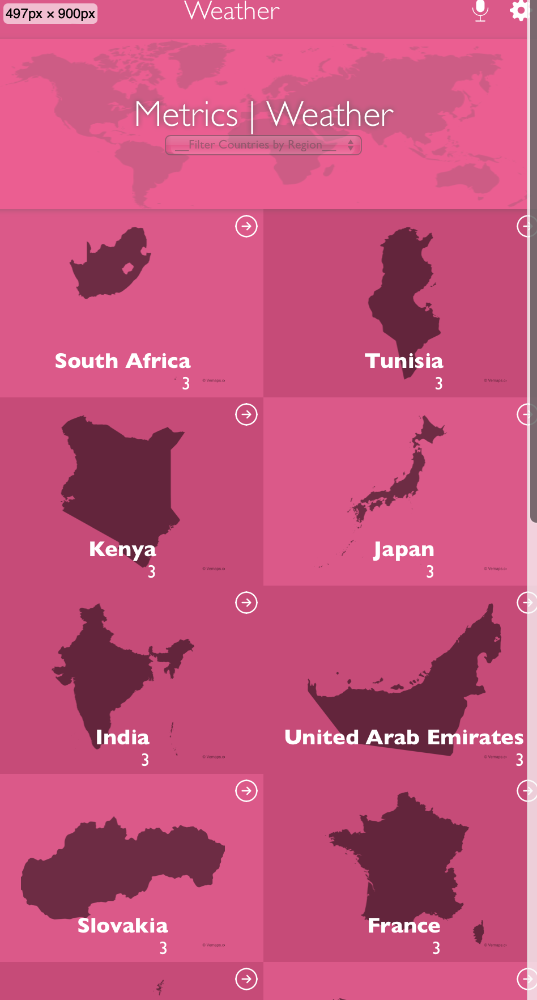

# Metrics App Capstone
> A weather metrics app that pulls from the Weather api to allow users view the weather from around the world.

## Built With
- React & Redux
- Stylelint, Web Hint, Lighthouse
- Eslint, Prettier
## Video Demo
[Video Demo]()
## Live Demo
[Live Demo Link](https://62c96a95ac1c7d5e4b874e3a--luminous-kulfi-ddf7f5.netlify.app)
## Getting Started
To get a local copy up and running, follow the steps in Setup below.
### Prerequisites
Basic knowledge of HTML, CSS, and JavaScript.
### Setup
If you installed git you can clone the code to your machine, or download a ZIP of all the files directly.
[Download the ZIP from this location](https://github.com/felixodette/metrics-app.git) command to clone the files to your machine:
```bash
git clone https://github.com/felixodette/metrics-app.git
```
- Once the files are on your machine, open the metrics-app folder in [Visual Studio Code](https://code.visualstudio.com/), and follow the steps in Installation & Set Up
## :hammer_and_wrench: Installation & Set Up
1. Install Node Modules
   ```sh
   npm install
   ```
2. Start the development server
   ```sh
   npm start
   ```
3. Open [http://localhost:3000](http://localhost:3000) to view it in the browser.
## :rocket: Building and Running for Production
1. Generate a full static production build
   ```sh
   npm run build
   ```
4. ## :rocket: Testing Application
1. Test the items Counter and Comments Counter function
   ```sh
   npm test
### Install
The following tools help make easier to work with sample code.
- [git](https://git-scm.com/downloads): A tool for managing source code
- [Visual Studio Code](https://code.visualstudio.com/): A source code editor
- [NVM](https://github.com/nvm-sh/nvm)
## **Felix Odete**
- GitHub: [@felixodette](https://github.com/felixodette)
- Twitter: [@Odette3000](https://twitter.com/Odette3000)
- LinkedIn: [felixodete](https://linkedin.com/in/felixodete)
## Acknowledgement
Original design idea by [Nelson Sakwa on Behance.](https://www.behance.net/gallery/31579789/Ballhead-App-%28Free-PSDs%29). Under the [Creative Commons License](https://creativecommons.org/licenses/by-nc/4.0/)
<br>
## :handshake: Contributing
Contributions, issues, and feature requests are welcome!
Feel free to check the [issues page](https://github.com/felixodette/metrics-app/issues).
## Show your support
Give a :star:️ if you like this project!
## :memo: License
This project is [MIT](./MIT.md) licensed.